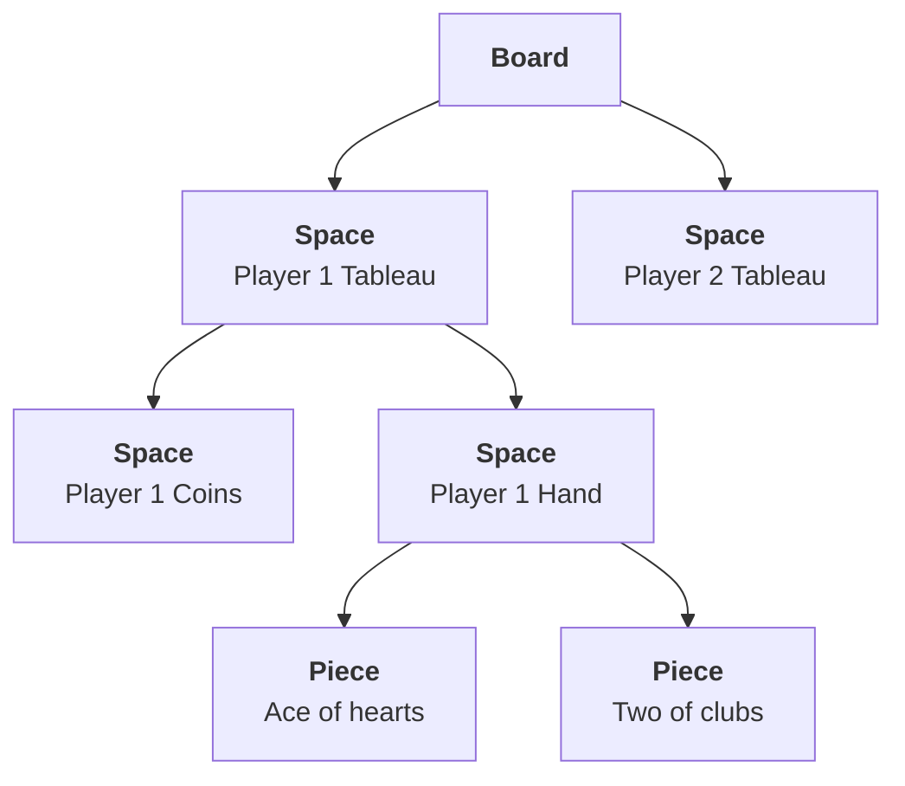

# Board Structure

The board is a singleton class that is declared as the first step of creating a
game. Creating a Boardzilla game automatically creates this class in `game/index.ts`
which can have properties and methods added to it. This class extends
the base [Board](../api/classes/board) class.

Boards contains [Spaces](../api/classes/space) (fixed regions) and
[Pieces](../api/classes/piece) (movable game objects). This is essentially a
hierarchy, with your board instance at the top of this hierarchy and the spaces and pieces placed within in it.
For example, a Board may have spaces for each player's tableau, and
inside those are spaces for the player's hand, and inside those are their
cards. All of these spaces and pieces are called the
[Elements](../api/classes/GameElement) of the game. Elements in Boardzilla
always have a parent-child relationship within the board.



In the context of an actual game board, the Spaces and Pieces in this diagram
might look something like this:


Here the <span style="color: #666"><b>Spaces</b></span> are grey and the <span
style="color: #009"><b>Pieces</b></span> are blue. Spaces can contain other
spaces and pieces. For example the Tableau here contains the Hand and the Hand
contains the Cards. Pieces can also contain other pieces, e.g. as when placing
tokens onto a card.

## Subclassing

Typically, a game will declare a few classes for your various game pieces, e.g. Cards, Tokens
and the like. Each of these will be a subclass of [Piece](../api/classes/piece). These subclasses can
add properties and methods that you can use in the rules of game. E.g. a `Card`
class, that might have `suit` and `number` properties, and special methods like
`isTrump()`.

```ts title="Example Card class"
export class Card extends Piece {
  suit: "S" | "H" | "D" | "C";
  number: number;

  isTrump() {
    return this.suit === this.game.trump;
  }
}
```

Spaces can be subclassed as well. This is less common, but helpful if you have
several spaces of a particular type that have special properties or behavior.

Defining subclasses like this also makes it easy to customize their appearance
later and give the different classes of Pieces entirely different visuals.

## Querying

Accessing parts of the board is done using the Query API on the board and the
spaces and pieces you add. The two most important methods are:

- [`all`](../api/classes/GameElement#all) Search the tree recursively and return _all_ matches
- [`first`](../api/classes/GameElement#first) Search the tree recursively and return only the _first_ match

In the example tree above, calling `board.all(Piece)` would return the two cards
at the bottom of the tree. If we used the Card class above, we could also have
used `board.all(Card)` to return the same thing but typed correctly to the Card
class. We can then also search by name, e.g. `board.first(Card, '2C')` to return
the Card named '2C', or add properties to the search, e.g. `board.first(Card, {
number: 1 })` to return the first ace in the game.

Any methods that return lists of elements, like `all`, actually return an
[ElementCollection](../api/classes/ElementCollection). This is an Array-like
class that can be treated like an array but also contains many other methods.

:::warning first can return undefined
Note that `first` can return `undefined` if no matching element is found. When using
`first`, you will frequently add `!` or `?` depending on the situation, which is
a good reminder to not assume that a piece is always where you expect, e.g.

```ts
// flip the top Card of the deck, if there are any
$.deck.first(Card)?.showToAll();
```

:::

For convenience, all uniquely named spaces are also accessible from a global `$`
object that contains all spaces by name, e.g. `$.deck`.

There are many more methods and options for finding particular game
elements. See the [API documentation](../api/classes/GameElement#queries) for
more.

## Creation

Spaces and pieces are created using the
[create](../api/classes/GameElement#create) method. All Game Elements have a
class and a name. The Class can be one of the based classes or one of the
subclasses you've declared. The name can be any string. It is used for searches,
determining uniqueness, and also appears in the HTML for CSS targetting. e.g.:

```ts
const tableau = board.create(Space, "tableau");
const hand = tableau.create(Space, "hand");
hand.create(Card, "2C");
```

You can also specify the properties during their creation with a 3rd argument:

```ts
  hand.create(Card, '2C', { suit: 'C', number: 2 });
  hand.create(Card, 'JS', { suit: 'S', number: 1 1});
```

## Ownership

All Game Elements also have an optional `player` property built-in. Setting this
property assigns the element to a [Player](../api/classes/Player). This is
useful for pieces and spaces that permanently belong to them, like their player
mat, or their unique player token. These elements can be created and queried
using the `player` property.

```ts
// create 2 tableaus for each player
board.create(Space, "tableau", { player: game.players[0] });
board.create(Space, "tableau", { player: game.players[1] });

// get player 1's tableau
board.first(Space, "tableau", { player: game.players[0] });
```

Any elements that are contained within an element assigned to a player are also
considered to be "owned" by that player, e.g. a card in their hand. These
elements can be queried using the `owner` property.

```ts
  // get player 1's cards
  board.all(Card { player: game.players[0] });
```

:::warning player vs owner
Rememeber the difference between `player` and `owner`. They are related but distinct.

- `player` is a property that can be set that assigns a game element to that player. It does not change automatically as a piece moves, so must be set again if you wish it to be assigned to a new player.
- `owner` is a read-only property that indicates if the piece currently resides in a space assigned to a player. As the piece moves this property is automatically updated to indicate who the current owner is. A Card might be owned by a player while they hold it, but if it moved to another player's hand, then the owner would be updated to reflect that change.

<div style="text-align:center"></div>
  :::

The Player object also conveniently has methods for retrieving these elements:
[my](../api/classes/Player#my) and [allMy](../api/classes/Player#allmy) for
retrieving one or many elements respectively

```ts
// get player 1's tableau
game.players[0].my("tableau");

// get player 1's cards
game.players[0].allMy(Card);
```

## Visibility

All elements are visible to all players by default. Often a game will require
that pieces are visible only to some players and hidden from others. In
Boardzilla, "hiding" a Game Element means that the properties of that element
are no longer visible. For example if one of our example `Card` instances was
flipped over, the player would be able to see that it was an instance of the
`Card` class, but `card.suit` and `card.number` would be `undefined`.

This can be accomplished in a number of ways, the simplest being
[`hideFromAll`](../api/classes/GameElement#hidefromall). There are many [other
methods](../api/classes/GameElement#visibility) for managing visibilty. It may
also be that some properties should be visible even when the element is hidden,
e.g. a Card may belong to different decks, and this is represented by
`Card#deck`. If the card back art indicates what deck it belongs to, then this
property should be revealed even if the card is hidden. You can set these
properties with the static method
[`revealWhenHidden`](../api/classes/GameElement#revealwhenhidden), e.g.:

```ts
Card.revealWhenHidden("deck");
```

## Movement

Pieces can be created in a particular place on the board, but will move around
as players take their actions. There are several ways to do this but the
simplest is [`putInto`](../api/classes/Piece#putinto).

```ts
// discard a card
card.putInto($.discard);

// draw the top card of the deck into the field
$.deck.first(Card).putInto($.field);
```

As cards move from space to space, you may want to change their
properties. These can be done automatically by adding event handlers to spaces. The most common type is to have spaces that change the visibility of their elements. E.g. when a card enters the deck, it should automatically be turned face down, or, when it enters a player's hand, it should be visible only to that player. This can be done with the [`onEnter`](../api/classes/Space#onenter) event handler. For example:

```ts
// the deck's cards are always face down
$.deck.onEnter(Card, card => card.hideFromAll();

// the player's hand always reveals their cards to `player`
const hand = board.create(Space, 'hand', { player });
hand.onEnter(Card, card => card.showTo(player));
```

There is also a corresponding [`onExit`](../api/classes/Space#onexit) handler.

## The pile and removing pieces

There is a special invisible region of the board called the "pile" available at
[`board.pile`](../api/classes/Board#pile). This is the holding area for any
pieces that are not in use. The pile is never rendered, but is always available
to the API for querying. Pieces are never created or destroyed once the game has
started, and instead are simply moved to or retrieved from the pile.

Remove a piece (move it to the pile) simply by calling it's
[`remove`](../api/classes/Piece#remove) method, or for a list of items,
the [ElementCollection#remove](../api/classes/ElementCollection#remove) can be
used. For example, to remove all cards from the deck that are lower than 5, we
can say:

```ts
$.deck.all(Card, (card) => card.number < 5).remove();
```

to put all the unused cards from the pile into the deck, we would say:

```ts
board.pile.all(Card).putInto($.deck);
```
